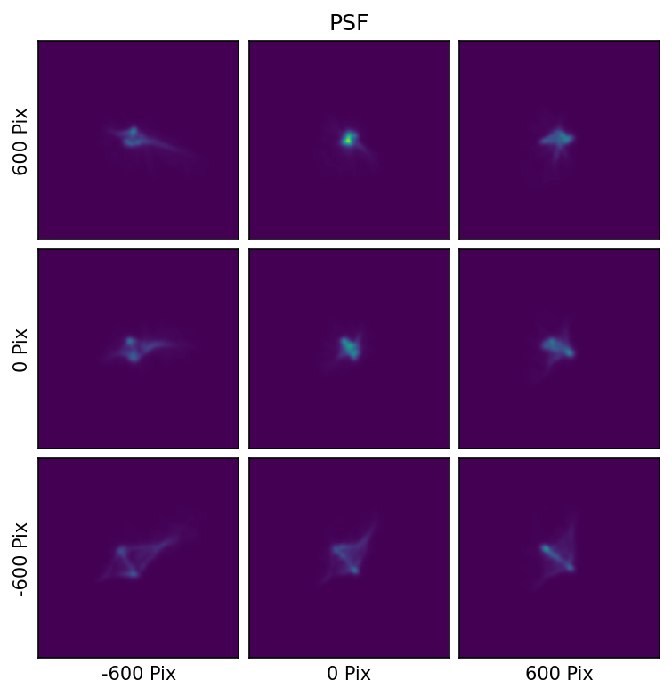

# PSF Class

This class implements tools needed to work with the PSF. Below is an example of the Pandora PSF in pixel space. This class enables users to work with the PSF files and

- evaluate it at any grid point (e.g. position, temperature, wavelength)
- evaluate the PRF (i.e. the PSF integrated on a pixel grid)
- find the gradient of the PSF or PRF

::: pandorapsf.psf.PSF
    selection:
      docstring_style: numpy
